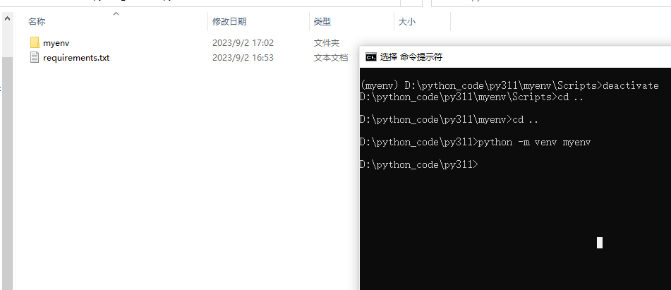
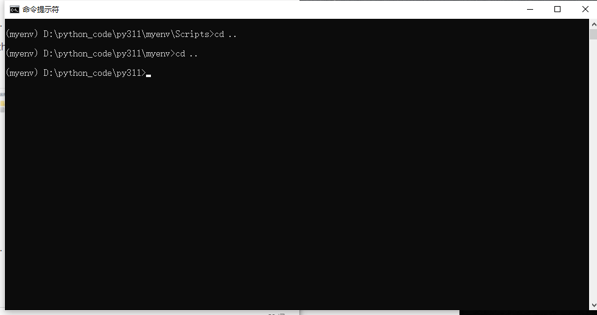
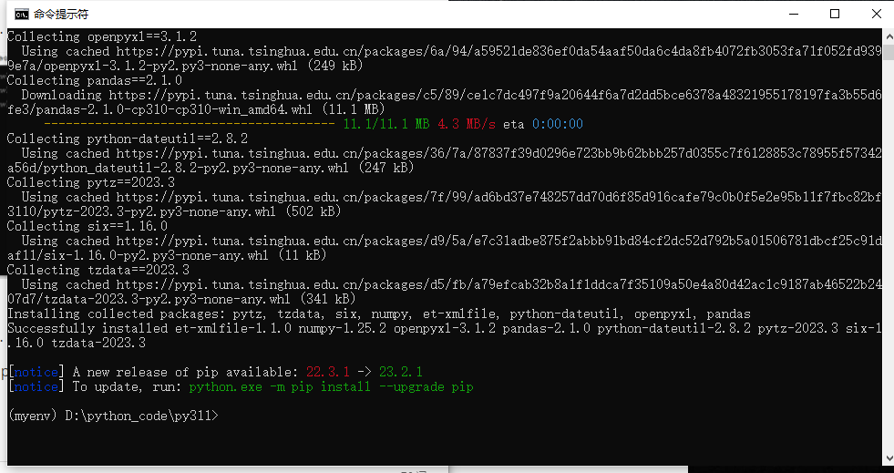
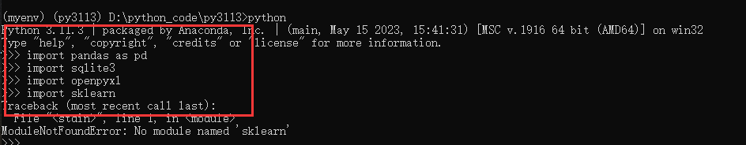

### System version

OS version：Microsoft Windows 10 

python version: python 3.11.3

### steps to build environment

1. Enter your project directory and create a virtual environment using the following command

``` 
python -m venv myenv
```





2. If you are on a Windows system, switch to myenv/Scripts, run activate, enter the virtual environment, and then switch back

```
cd myenv/Scripts
activate
cd ..
cd ..
```



If you are on Mac OS or Linux, use the following command to activate the virtual environment

``` 
source myenv/bin/activate
```

3. Install the required package using the following command

```
pip install -r requirements.txt
```





4. Check if the package is available. It can be seen that pandas, sqlite3, and openpyxl are all available, while Skylearn is not installed, so it will display that this module is not available.

